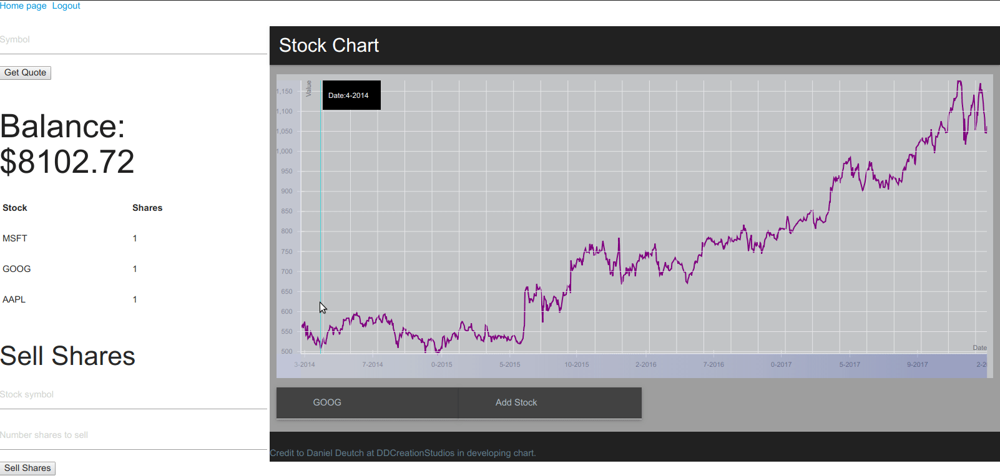
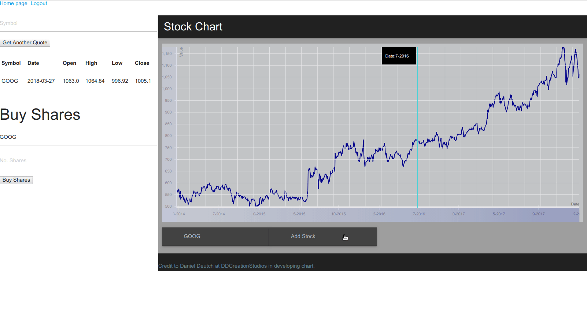

## Overview
This is a dynamic website for buying and selling stocks. Once a user creates an account, their portfolio starts off with $10,000 and no shares. They can then get stock quotes and buy and sell shares. Daily quotes and historical data are pulled from [Quandl](https://www.quandl.com).

This website began as a project for the course CS 75-Building Dynamic Websites MOOC (Harvard Extension School) by David Malan. In addition to the project specification, a stock chart React component developed by [Daniel Deutsch](http://github.com/DDCreationStudios) using the React-Vis visualization library has been implemented.

## Screenshots

## Credits
The React stock chart was developed by Daniel Deutsch. Code can be found [here](http://github.com/DDCreationStudios).

## TODO
Implement feature for dynamically adding quote data to stock chart.
